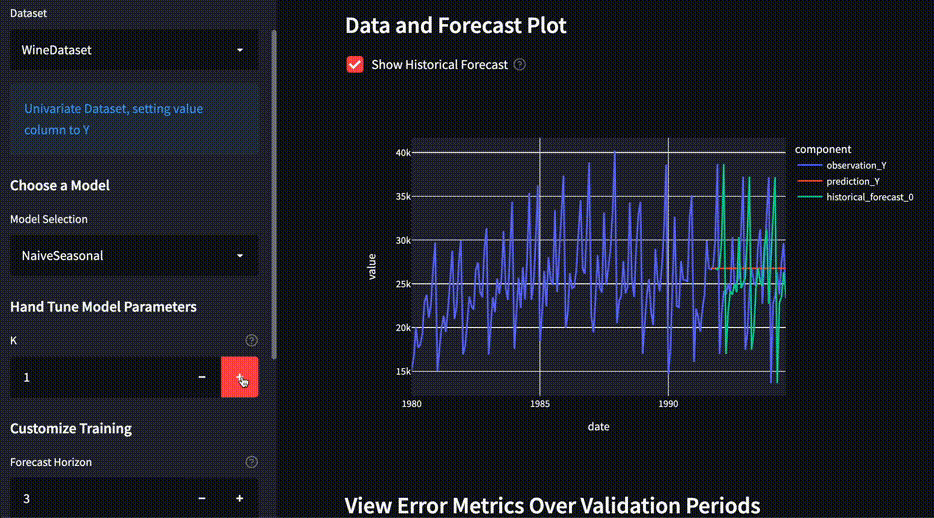
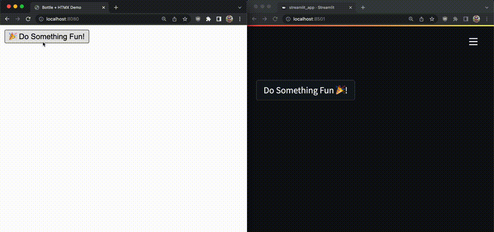
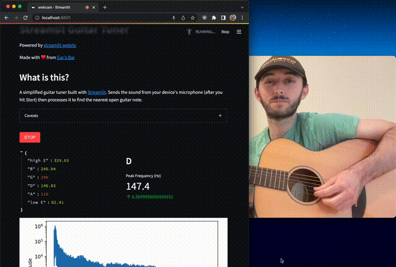
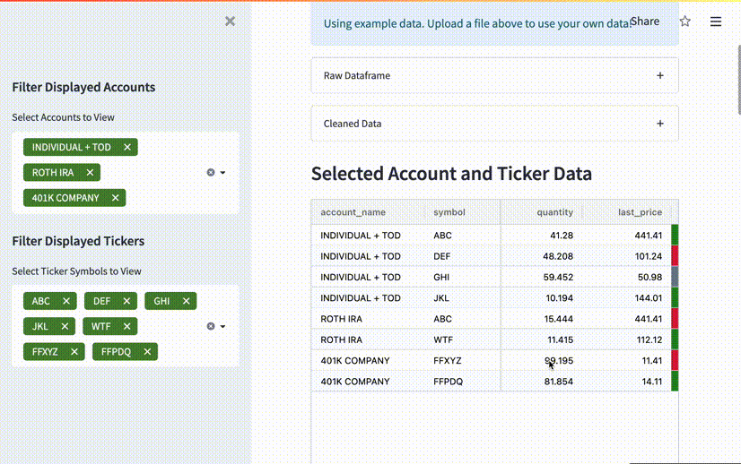
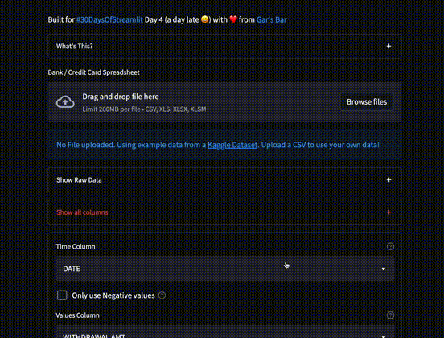
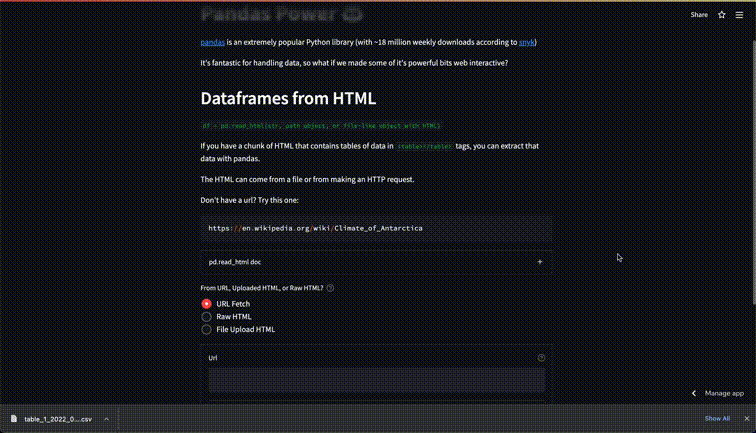
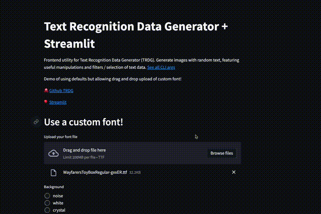
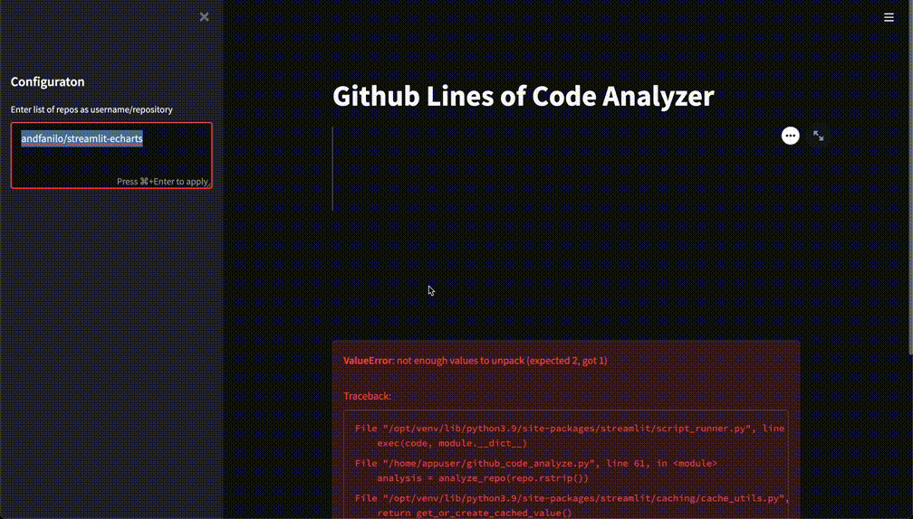

## Welcome :beers

I'm a software engineer interested in the web, machine learning, and how both impact us. This is my homepage, feel free
to poke around.

Most excited about time series data for environmental and social impact.

Recently I've been working mostly in Python on topics ranging from ETL automation to mortgage returns to Computer
Vision.

For more about me, head to [my blog](https://tech.gerardbentley.com/).

## Some Demos

Here's a selection of projects I've recently been hacking on!

## :dart: Darts API Playground

Explore the Datasets, Metrics, and Models of the Darts Time Series library.

See: [Github Repo](https://github.com/gerardrbentley/darts-playground)

## :link: URL Scanner

Using AWS Rekognition + Streamlit to provide interactive OCR URL Scanner / Text Extraction on real world images.

See: [Github Repo](https://github.com/gerardrbentley/streamlit-url-scanner)

## 🥞 WSGI Stack vs Streamlit

Comparing an interactive web app built with `bottle` + `htmx` to the same idea built with `streamlit`.

In folder `wsgi_comparison`

🎥 Watch: [Youtube Breakdown](https://www.youtube.com/watch?v=4V3VACzOmrI&t=2s)
✍🏻 Read: [Blog Post](https://tech.gerardbentley.com/streamlit/python/beginner/2022/03/23/bottle-htmx-streamlit.html)

Left: ~50 lines of Python and HTML

Right: ~15 lines of Python

## 🎸 Guitar Tuner

Simple guitar tuner powered by `streamlit-webrtc`

## :computer: Streamlit Full Stack 3 Ways

Demo of Full Stack Streamlit Concept.
Deployed with 3 increasingly complicated backends.

See: [Github Repo](https://github.com/gerardrbentley/streamlit-fullstack)

#### :mouse: Littlest

#### :elephant: Postgres Version

#### :rat: Go Backend Version

## :chart_with_upwards_trend: Fidelity / Personal Stock Account Dashboard

Upload a CSV export from Fidelity investment account(s) and visualize profits and losses from select tickers and accounts.

See: [Github Repo](https://github.com/gerardrbentley/fidelity-account-overview)

## 💰 Personal Spending Dashboard

Upload a CSV or excel with at least a date column and spending amount column to analyze maximum and average spending over different time periods.

## :mount_fuji: Peak Weather: NH 4,000 Footers

Use async http request library `httpx` to make 48 api calls roughly simultaneously in one Python process.
Feed a dashboard of weather for all 4,000 foot mountains in New Hampshire.

See: [Github Repo](https://github.com/gerardrbentley/peak-weather)

## 🐼 Pandas Power

Demoing useful functionalities of Pandas library in a web app.

Currently:

- `read_html`: Parse dataframes from html (url, upload, or raw copy+paste)

## ✍🏻 Text Recognition Dataset Generator App

Putting a frontend on TRDG CLI tool.
Primary goal: creating classic videogame text screenshots with known ground truth labels

## 🐙 Github Lines of Code Analyzer

Shallow clone a repo then use unix + pandas tools to count how many lines of each file type are present

`streamlit run github_code_analyze.py`

## :books: AWS Textract Document Text Scan

Using AWS Textract + S3 + Streamlit to provide interactive OCR Web App.

See: [Github Repo](https://github.com/gerardrbentley/textract-streamlit-example)
